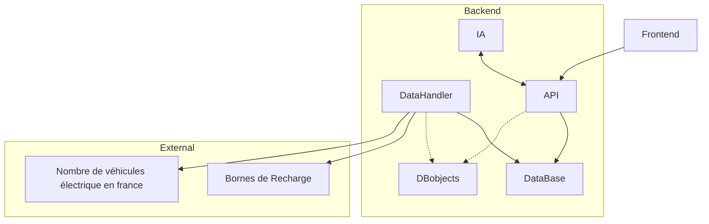

# Architecture du projet

# Choix des technologies
Dans un premier temps, nous ferons un front-end avec **Angular**.
Nous travaillons sur cette technologie en module de WEB et sommes donc plus à l’aise avec.

Pour le back-end, nous avons choisi d'utiliser Java car nous avons de l'expérience avec ce langage et en maîtrisons les concepts, en effet, le framework **Spring** nous permettra de gérer les requêtes, nous en profitons aussi pour apprendre de nouvelles choses. 

Afin de pouvoir lancer facilement l'application dans différents environnement, nous privilegierons l'utilisation de **Docker**.

# Docker
Le projet peut être lancé de 3 manières différents : `local`, `dev` ou `prod`.

## Local
Le local permet de lancer les projets java ou angular directement sur la machine. Cette méthode n'est pas recommandé, car si la base de donnée n'est pas lancé, les programmes vont se stopper.  

## Dev
L'environnement de dev peut être lancé avec le script `dev.sh`. Il la créer des docker pour aider le développer à coder et relancer le code plus facilement. Effectivement, les dockers de front et de back sont en `watch mode`. C'est à dire qu'a chaque modification de code, le programme va se relancer avec les nouvelles modifications effectuées.

## Prod
L'environnement de prod peut être lancé avec le script `prod.sh`. Il build toutes les images afin d'obtenir une application légère et performante. Ces images pourront ensuite être envoyé sur docker hub grâce au script `push.sh`.

De cette façon, il est facile pour le développer de changer d'environnement et de tester la version production avant de l'envoyer sur server.

# Services
## DBobjects
Une libaraire Java Spring est utilisé pour faire le pont des objets entre l'API et de DataHandler. Effectivement, ces 2 programmes ont besoin d'objets de base de donnée communs. C'est pour cela que la librairie `DBobjects` a été créé. Cela permet une cohérence sur tout le projet. Une modification de ces fichiers sera répercuté sur les 2 autres projets.

## DataHandler
Le programme Spring DataHandler est responsable du téléchargement des Datasets pour les mettre en base de donnée. Il va s'exécuter tous les jours à 1h du matin, si la base de donnée est vide au démarrage, ou si la variable `DATAHANDLER_UPDATE_ON_STARTUP` est à `true`.  
Les 2 urls des datasets sont définis dans le fichier `application.properties` du projet Spring.

## API
L'API Spring permet au Frontend de récupérer les données quand il le souhaite. Elle revoie les données sous forme de tableau de string. Effectivement, le json est une perte d'espace, car pour chaque borne, les noms des attributs doivent être présents et rajoutent énormément de caractères.

## FRONTEND

Le frontend est un programme fait avec Angular. Il permet à l'utilisateur la visualisation des données. Il va récupérer les information directement via l'API une fois la page chargée.

## Nginx

Nginx est proxy qui nous permet de mettre à disposition le front et l'API sur le même port. De cette façon, on peut utiliser l'entièretée des services via ce proxy.

| Endpoint | Service          |
|----------|------------------|
| /        | Frontend Angular |
| /api/    | API Spring       |