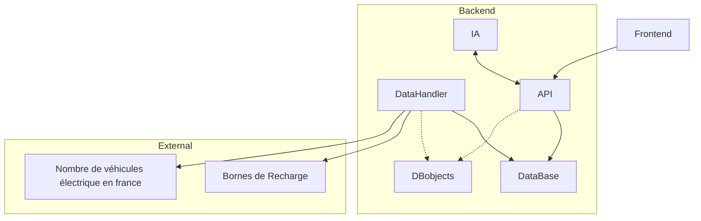

# Architecture du projet

# Choix des technologies
Dans un premier temps, nous ferons un front-end avec **Angular**.
Nous travaillons sur cette technologie en module de WEB et sommes donc plus à l’aise avec.

Pour le back-end, nous avons choisi d'utiliser Java car nous avons de l'expérience avec ce langage et en maîtrisons les concepts, en effet, le framework **Spring** nous permettra de gérer les requêtes, nous en profitons aussi pour apprendre de nouvelles choses. 

Afin de pouvoir lancer facilement l'application dans différents environnement, nous privilegierons l'utilisation de **Docker**.