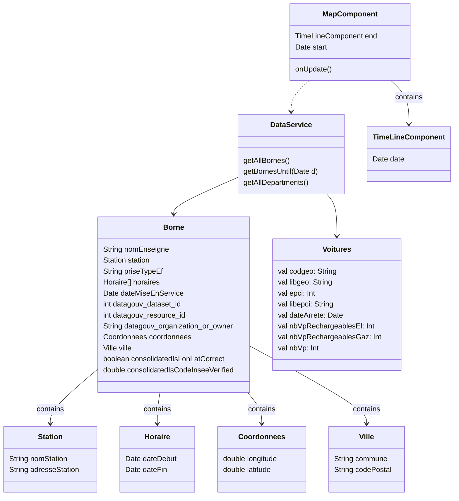

# Class diagram

```mermaid

classDiagram

class DataService {
    getAllBornes()
    getBornesUntil(Date d)
    getAllDepartments()
}

class TimeLineComponent {
    Date date
}

class MapComponent {
    TimeLineComponent end
    Date start

    onUpdate()
}

class Borne {
    String nomEnseigne
    Station station
    String priseTypeEf
    Horaire[] horaires
    Date dateMiseEnService
    int datagouv_dataset_id
    int datagouv_resource_id
    String datagouv_organization_or_owner
    Coordonnees coordonnees
    Ville ville
    boolean consolidatedIsLonLatCorrect
    double consolidatedIsCodeInseeVerified
}
class Horaire {
    Date dateDebut
    Date dateFin
}
class Station {
    String nomStation
    String adresseStation
}
class Coordonnees {
    double longitude
    double latitude
}
class Ville {
    String commune
    String codePostal
}

class Voitures {
    val codgeo: String
    val libgeo: String
    val epci: Int
    val libepci: String
    val dateArrete: Date
    val nbVpRechargeablesEl: Int
    val nbVpRechargeablesGaz: Int
    val nbVp: Int
}

Borne --> Station : contains
Borne --> Horaire : contains
Borne --> Coordonnees : contains
Borne --> Ville : contains

DataService --> Borne
DataService --> Voitures

MapComponent ..> DataService
MapComponent --> TimeLineComponent : contains

```