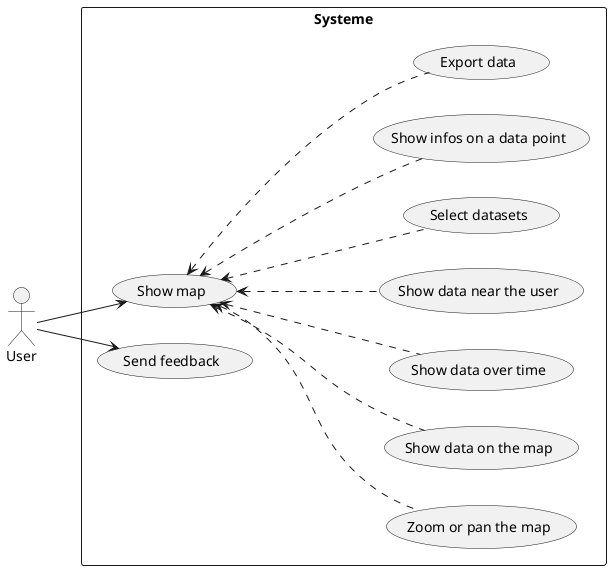

# Use Cases

## List of Use Cases
- Show map
- Zoomer avec des boutons sur la carte
- Afficher des données de dataset sur la carte
- Afficher les données en fonction du temps
- Afficher les données à proximité de l'utilisateur
- Filtrer les données affichées
- Afficher des informations détaillées sur une donnée

## User stories :

### Export data

### Zoom and pan

### Full scenario

### Select data set

### Show feedback

### Show data near user

### Show data over time

### Show infos on data point

### Show Map
