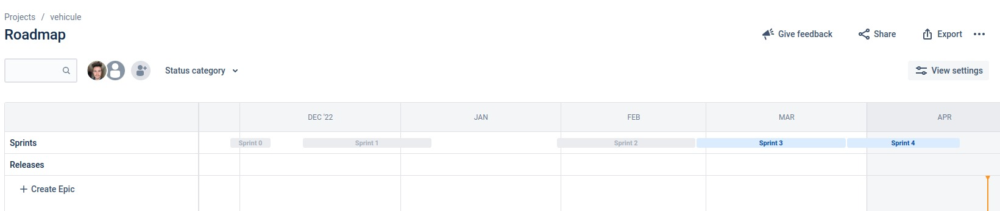
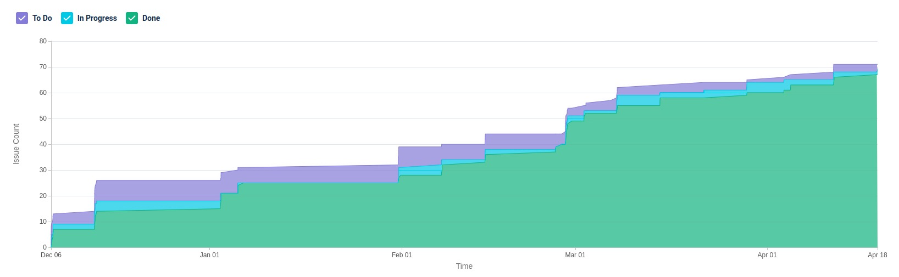

# Sprints
## Sprint 0
Début: 29 novembre  
Fin: 6 décembre  
Objectifs : documenter les idées et organiser le projet

C'est dans ce sprint que nous avons définis nos outils de gestion de projet, et les users stories. L'architecture a été définie mais finalement changé plus tard au Sprint 2

## Sprint 1
Début: 13 décembre  
Fin: 6 janvier  
Objectifs : Afficher une carte avec des points sur un site wweb

Ce sprint se concentre principalement sur la création du frontend. C'est celui qui a été présenté au semestre 1.  
Quelques données sont écris en brut dans le JavaScript. Ce sprint a permis de voir la faisabilité du projet et d'estimer ce qui sera possible pour le futur.

## Sprint 2
Début: 31 janvier
Fin: 26 février  
Objectifs : Réaliser les différents modules de l'architecture et afficher toutes les données / utilisation de docker

Lors de ce sprint, l'architecture a été repensée et est celle définie dans le document d'architecture. Avec ce document les taches ont étés réparties entre tous les membres du groupe.  
Ce sprint a été réalisé et toutes les bornes ont étés affichés, mais un problème de performance a été soulevé

## Sprint 3
Début: 27 février  
Fin: 27 mars  
Objectifs : Fixer les performances et démarrer l'IA

L'application fonctionne mais n'est pas vraiment utilisable. C'est pour cela que ce sprint est entièrement consacré à l'amélioration des performances (API et FRONT), afin d'alléger les données sans perdre d'informations.  
La partie IA a été démarrée, mais s'est finalement terminé par différentes statistiques car nous ne trouvons pas d'intérêt particulier à en utiliser dans ce projet.

## Sprint 4
Début: 28 mars  
Fin: 18 avril
Objectifs : Ajouter un dataset

Nous voulons maintenant ajouter le dataset du nombre de voitures. Ajouter un dataset et afficher / corréler les données entre elles est une partie longue que nous avons sous-estimée. Effectivement l'architecture nous donne un endroit où télécharger les données et les mettre en base, mais il reste tout le travail de les transcrire en objets, les rendre accessible dans l'API et surtout les afficher sur le front.  
À la fin de ce sprint, le nombre de vehicules par département est affiché sur la carte.

# Stats

Voici un aperçu graphique dans le temps de nos sprints pour le projet.
Chaque sprint a duré environ 3 à 4 semaines.

Nous avons été réguliers tout au long de ce semestre avec des commits toutes les semaines, comme nous pouvons l’observer sur le graphique ci-dessus.
