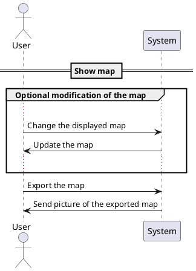

# Export data usercase

```puml
@startuml

Actor User as U
Participant System as S

== Show map ==

group Optional modification of the map
...
    U -> S : Change the displayed map
    S -> U : Update the map
...
end

U -> S : Export the map
S -> U : Send picture of the exported map

@enduml
```