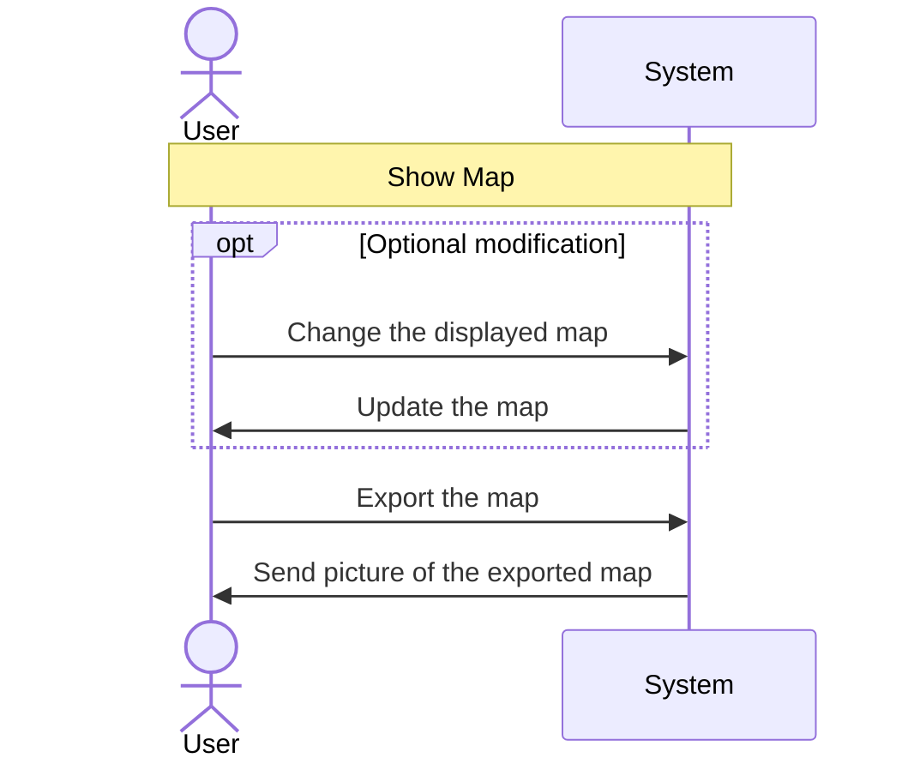

# Export data usercase

```mermaid
sequenceDiagram
    actor U as User
    participant S as System
    
    note over U, S: Show Map
    
    opt Optional modification
        U ->> S : Change the displayed map
        S ->> U : Update the map
    end
    
    U ->> S : Export the map
    S ->> U : Send picture of the exported map
```