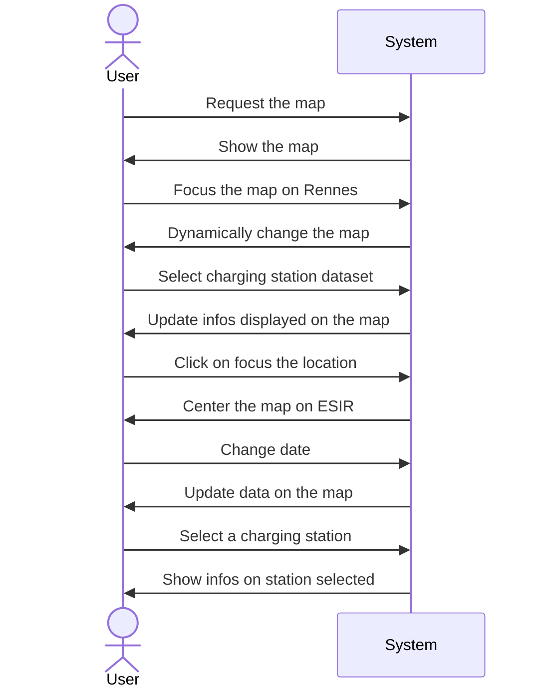

# Scenario usercase

```mermaid
sequenceDiagram

    actor U as User
    participant S as System
    
    U ->> S : Request the map
    S ->> U : Show the map
    U ->> S : Focus the map on Rennes
    S ->> U : Dynamically change the map
    U ->> S : Select charging station dataset
    S ->> U : Update infos displayed on the map
    U ->> S : Click on focus the location
    S ->> U : Center the map on ESIR
    U ->> S : Change date
    S ->> U : Update data on the map
    U ->> S : Select a charging station
    S ->> U : Show infos on station selected

```