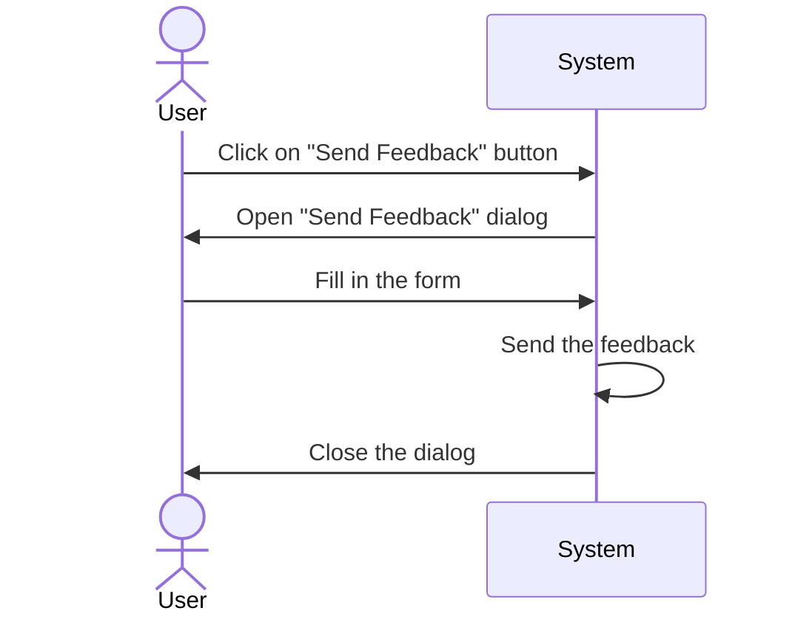

# Send feedback usecase

```mermaid
sequenceDiagram

    actor U as User
    participant S as System
    
    U ->> S : Click on "Send Feedback" button
    S ->> U : Open "Send Feedback" dialog
    U ->> S : Fill in the form
    S ->> S : Send the feedback
    S ->> U : Close the dialog

```