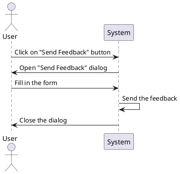

# Send feedback usecase

```puml
@startuml

Actor User as U
Participant System as S

U -> S : Click on "Send Feedback" button
S -> U : Open "Send Feedback" dialog
U -> S : Fill in the form
S -> S : Send the feedback
S -> U : Close the dialog

@enduml
```