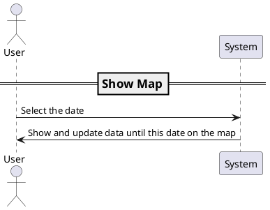

# Show data over time usecase

```puml
@startuml

Actor User as U
Participant System as S

=== Show Map ==

U -> S : Select the date
S -> U : Show and update data until this date on the map

@enduml
```