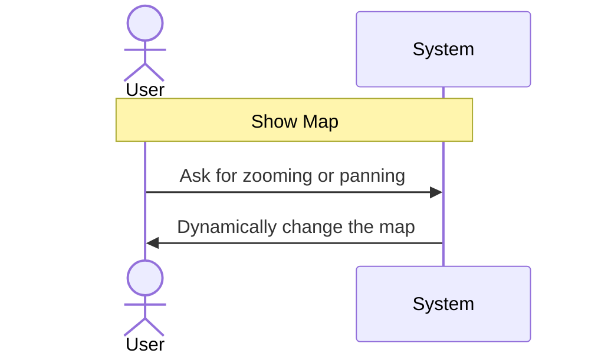

# Zoom or pan the map

```mermaid
sequenceDiagram
    actor U as User
    participant S as System
    
    note over U, S: Show Map
    
    U ->> S : Ask for zooming or panning
    S ->> U : Dynamically change the map
```